# Лабораторная работа №4  
## Средства постэксплуатации. Анализ Command & Control фреймворка

---

### Выполнили:
- студент 5 курса группы **21-КАС-1**  
  **Гофман Никита Антонович**
- студент 5 курса группы **21-КАС-1**  
  **Аксенов Владислав Вячеславович**

---

## Цель работы

Изучить принципы работы фреймворков постэксплуатации (Command & Control), разобрать архитектуру C2-систем, получить практические навыки развёртывания сервера управления, создания полезной нагрузки, получения Beacon-сессии и анализа возможностей злоумышленника после компрометации целевой системы.

---

## Используемый фреймворк

**Cobalt Strike 4.9**

Фреймворк широко применяется в реальных атаках и предоставляет полный набор средств для постэксплуатации, управления Beacon-агентами, pivoting и lateral movement.

---

## Среда выполнения

### Сервер и клиент C2
- ОС: **Ubuntu**
- IP: 192.168.3.26
- Назначение: запуск Team Server и GUI-клиента Cobalt Strike

### Целевая система
- ОС: **Windows 10**
- - IP: 192.168.3.25
- Назначение: запуск полезной нагрузки и получение Beacon-сессии

Все действия выполнялись **исключительно в виртуальной среде**, виртуальные машины находились в одной локальной сети.

---

## 1. Запуск сервера Cobalt Strike

На сервере Ubuntu был запущен Team Server Cobalt Strike:

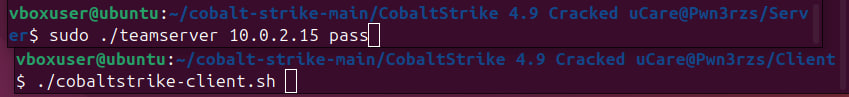

Сервер ожидает подключение клиента управления.

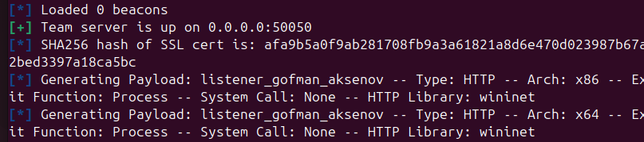

---

## 2. Запуск клиентского GUI

На машине Ubuntu был запущен клиент Cobalt Strike.

После подключения отображается графический интерфейс управления.

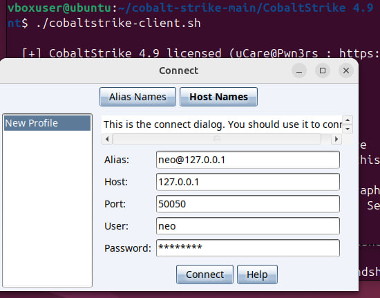

---

## 3. Создание HTTP Listener

В интерфейсе Cobalt Strike был создан HTTP Listener для приёма Beacon-сессий.

Параметры:

* Тип: HTTP
* Порт: 80

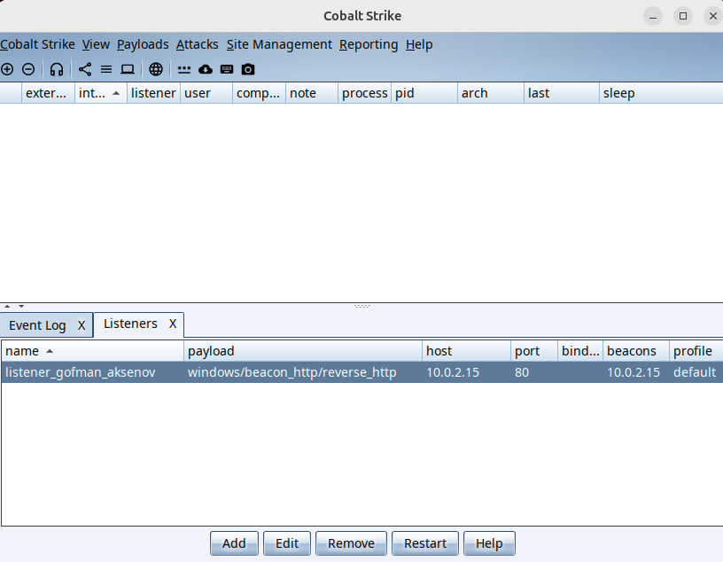

---

## 4. Генерация полезной нагрузки

Была создана полезная нагрузка типа **Windows Stager Payload**.

### Доступные типы payload:

* Windows Stager Payload
* Windows Stageless Payload
* HTML Application
* Office Macro

Stager используется для загрузки основного Beacon с сервера.

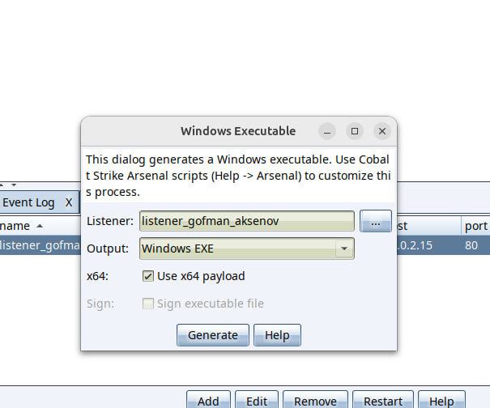

---

## 5. Получение Beacon-сессии

После запуска payload на Windows 10 была получена Beacon-сессия и запущен VNC.

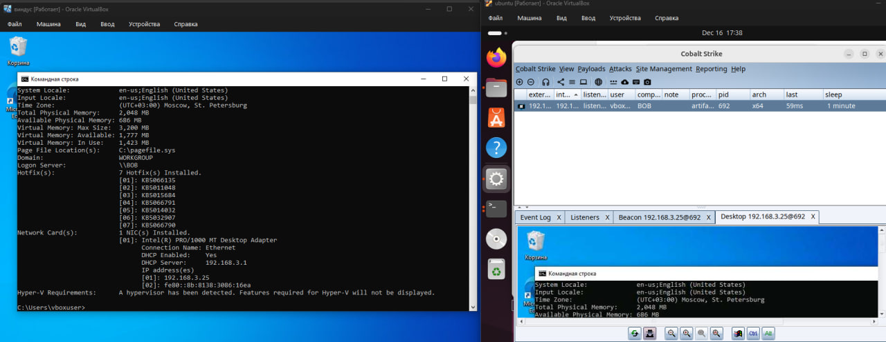

---

## 6. Работа с Beacon через CLI

Через CLI-интерфейс Beacon оператор получает управление системой.
Команда `systeminfo` позволяет определить версию ОС, архитектуру и системные параметры.
Пример выполнения команд:

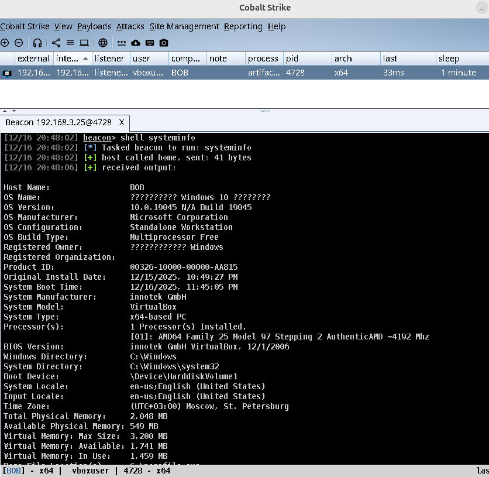

После получения Beacon-сессии оператор получает полный набор команд для управления заражённой системой. 
Ниже приведён обзор основных групп команд и их назначения.

Управление сессией и связью

Данные команды отвечают за управление состоянием Beacon и его взаимодействие с C2-сервером:

! — повтор последней выполненной команды
checkin — немедленное соединение Beacon с C2-сервером
clear — очистка очереди задач Beacon
exit — завершение Beacon-сессии
sleep — изменение интервала опроса C2-сервера
unlink — отключение Beacon от родительской сессии
note — добавление заметки к Beacon
help — вывод справки по доступным командам
history — просмотр истории выполненных команд
Эти команды позволяют оператору гибко управлять активностью Beacon и снижать вероятность обнаружения.
**Навигация и работа с файловой системой**
**Команды для взаимодействия с файловой системой целевой ОС:**
cd — смена текущего каталога
pwd — вывод текущего каталога
ls — список файлов и каталогов
drives — список доступных логических дисков
mkdir — создание каталога
rm — удаление файлов и каталогов
cp — копирование файлов
mv — перемещение файлов
upload — загрузка файла на целевую систему
download — скачивание файла с целевой системы
downloads — просмотр активных загрузок
cancel — отмена текущей загрузки
**Выполнение команд и программ**
**Позволяют удалённо выполнять команды и программы:**
run — запуск программы с выводом результата
execute — запуск программы без вывода
shell — выполнение команд через cmd.exe
powershell — выполнение команд через powershell.exe
powerpick — выполнение PowerShell без запуска powershell.exe
execute-assembly — запуск .NET-программ напрямую из памяти
inline-execute — выполнение Beacon Object File (BOF)
psinject — выполнение PowerShell-кода в конкретном процессе
**Процессы и работа с памятью**
**Используются для управления процессами и внедрения кода:**
ps — список запущенных процессов
kill — завершение процесса
inject — внедрение Beacon в процесс
dllinject — внедрение DLL
dllload — загрузка DLL через LoadLibrary()
shinject — внедрение shellcode
shspawn — создание процесса и внедрение shellcode
spawn — запуск нового Beacon
spawnto — выбор процесса для внедрения
runu — запуск под другим PID
ppid — подмена родительского процесса
**Привилегии и учетные данные**
**Команды для повышения привилегий и работы с токенами**
getuid — текущий пользователь
getprivs — доступные привилегии токена
getsystem — попытка получения SYSTEM
elevate — запуск Beacon с повышенными правами
rev2self — возврат к исходному токену
steal_token — кража токена процесса
make_token — создание токена другого пользовател
token-store — управление сохранёнными токенами
Учетные данные и аутентификация
Используются для компрометации учетных данных:
logonpasswords — извлечение учетных данных из памяти
hashdump — дамп NTLM-хэшей
mimikatz — выполнение команд mimikatz
pth — атака Pass-the-Hash
dcsync — извлечение хэшей из контроллера домена
kerberos_ticket_use — применение Kerberos-билета
kerberos_ccache_use — загрузка Kerberos-кеша
kerberos_ticket_purge — очистка Kerberos-билетов
**Сеть и перемещение (Lateral Movement)**
**Команды для сетевого взаимодействия и распространения внутри сети:**
net — сетевое перечисление
portscan — сканирование портов
jump — lateral movement на другой хост
remote-exec — удалённый запуск команд
connect — TCP-соединение Beacon
link — соединение через именованные каналы
browserpivot — pivot через браузер
socks — запуск SOCKS-прокси
rportfwd — reverse port forwarding
spunnel — туннелирование Beacon
**Мониторинг действий пользовател**
**Команды для слежения за действиями пользователя:**
desktop — удалённый рабочий стол (VNC)
screenshot — создание скриншота
printscreen — скриншот через PrintScreen API
screenwatch — периодические скриншоты
clipboard — чтение буфера обмена
keylogger — перехват нажатий клавиш
chromedump — извлечение данных Google Chrome
---

## 7. Работа с процессами

С помощью `Process List` получает список процессов целевой системы.

Доступные действия:

* завершение процессов;
* внедрение Beacon;
* внедрение shellcode;
* Steal Token.

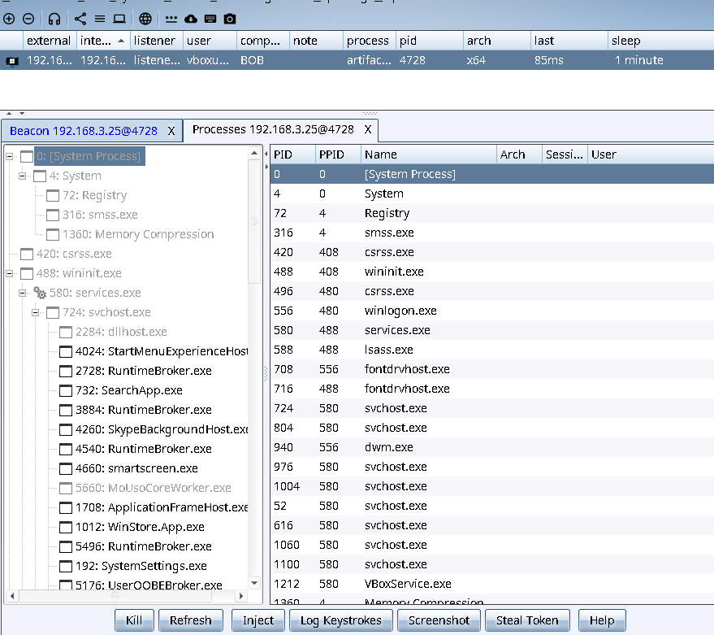

---

## 8. Инжект в процесс

Beacon может быть внедрён в легитимный процесс (например, `svchost.exe`) для маскировки и повышения устойчивости.

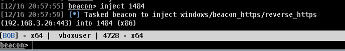

---

## 9. Контекстное меню Beacon (Explore)

При нажатии ПКМ по Beacon доступны функции:

* Desktop (VNC)
* File Browser
* Process Browser
* Net View
* Port Scan
* Screenshot
* Browser Pivot

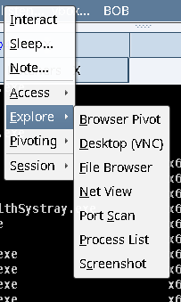

---

## 10. Pivoting и SOCKS Proxy

Beacon позволяет развернуть SOCKS-прокси:

Pivoting используется для доступа к внутренним сегментам сети жертвы и дальнейших атак с использованием proxychains.

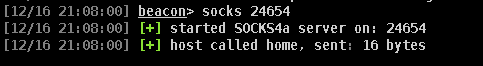

---

## Вывод

В ходе выполнения лабораторной работы были изучены принципы работы C2-фреймворков и практические аспекты постэксплуатации. Был выполнен запуск сервера и клиента Cobalt Strike на Ubuntu, создан listener, сгенерирована полезная нагрузка для Windows 10 и получена Beacon-сессия.
В процессе работы были рассмотрены возможности злоумышленника после компрометации системы: выполнение команд, управление процессами, внедрение кода, pivoting и проксирование трафика. Лабораторная работа позволила на практике понять архитектуру C2-систем и сценарии их использования.

